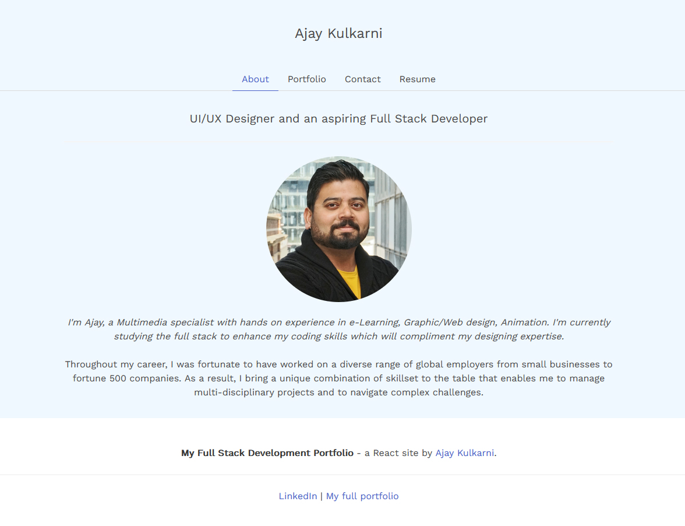

# 20 React: React Portfolio

## Description 

For this project I have developed my portfolio using newly learnt React skills. The portfolio features some of the applications I worked on.

[Click here to view the application](https://ajaykulkarni01.github.io/React-Portfolio)

Following image shows the application screenshot. 

## Table of Contents 
- [Installation](#installation)
- [Features](#features)
- [Contribute](#contribute)
- [License](#license)

## Installation
This application does not require installation. [Click here](https://ajaykulkarni01.github.io/React-Portfolio) to view the application.

## Features 
This appplication has the following features used in it

-   Bulma
-   font awesome
-   gh-pages
-   google font
-   jquery
-   react
-   react-dom
-   react-hook-form
-   react-popupbox
-   react-scripts
-   react-scroll
-   react-share
-   react-typed
-   tsparticles

## License
This project is released under the [MIT LICENSE](https://img.shields.io/badge/license-MIT-blue)